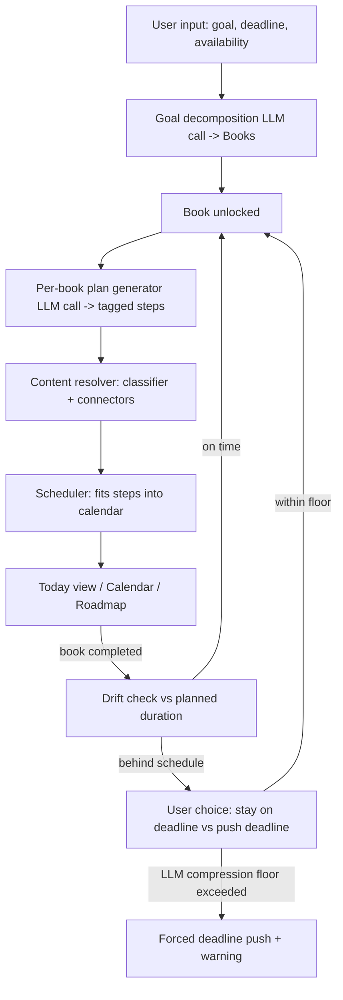

# Learning Scheduler App — Project Plan

## 1. Purpose

A study project to learn mobile development and mobile testing, built to a
standard that can be reviewed by senior developers and a senior product
designer. Not just a toy — real auth, real architecture, real trade-offs.

## 2. Core Concept

The user types a learning goal and a deadline (e.g. *"I need to learn
Calculus II in 3 months"*). An LLM breaks that goal into an ordered list of
small steps/activities. The user separately describes which days of the
week they're available to study and for how long each day. The activities
are then automatically allocated onto a calendar. The main screen is
"today's activities," with navigation to other days and to a calendar view.

## 3. Scope & Domain

- Open to **any** learnable subject — not a fixed list of categories.
- If a step can't be sourced from an online resource (e.g. "go to your
  local museum and look for Rococo painting"), it becomes a generic
  **task**-type activity block instead of a resource.
- **Broad goals get split into "Books."** E.g. "learn Linux" becomes a
  sequence of books, each with its own schedule and activity list. The
  next book only unlocks once the previous is fully completed, and a
  book's detailed schedule is only generated once it unlocks (not all
  upfront). A narrow goal (e.g. "Calculus II in 3 months") can legitimately
  decompose into a single book — the LLM decides breadth, it isn't
  hard-coded.

## 4. High-Level Architecture



Services:
- **Backend API** — Rust (Axum), talks to Postgres, the LLM endpoint, and
  the PDF sidecar.
- **PDF extraction sidecar** — Python container (PyMuPDF/pdfplumber/GROBID),
  called over HTTP by the backend.
- **Postgres** — all persistent data.
- **Flutter app** — mobile client.
- **NVIDIA NIM** — free LLM endpoint used for prototype (plan generation,
  translation, decomposition).
- Everything orchestrated via **Docker Compose**.

## 5. Data Model (core tables)

- `users` — id, email, password_hash, role (`user`/`admin`), preferred_language
- `goals` — id, user_id, title, why_statement (optional emotional driver),
  deadline (original), target_deadline (mutable), availability (days/time)
- `books` — id, goal_id, order_index, title, description, status
  (`locked|unlocked|in_progress|completed`), planned_duration, min_duration
  (LLM-estimated compression floor), actual_duration
- `steps` — id, book_id, order, title, activity_kind
  (`resource|quiz|task`), estimated_duration, references_step_id (for
  spaced-repetition review steps pointing back at earlier material)
- `activities` — id, step_id, type (video/podcast/pdf/article/quiz/task),
  resource_url/embed_id, source_connector, language, completed (bool)
- `schedule_slots` — id, step_id, date, time_range

## 6. LLM Pipeline (two stages)

1. **Decomposition (once, at goal creation)** — LLM produces just the
   "table of contents": ordered books with title/description/estimated
   relative weight. No steps or resources yet.
2. **Detailed scheduling (per book, on unlock)** — full pipeline runs using
   the *current* remaining time and *current* user availability: plan
   generator → activity-kind tagging → content resolver → scheduler.

Design principles borrowed from the "WINS" learning framework
(why-powered goals, incremental progress, neural-friendly patterns,
support network):
- Capture an optional emotional "why" at goal creation; show it as a
  persistent reminder.
- Every day should include one small near-guaranteed "quick win" activity
  (5–15 min), not just the main block.
- Insert **spaced review steps** referencing earlier steps at increasing
  intervals (`references_step_id`), not a purely linear sequence.
- Deliberately vary activity type per sub-topic (multi-modal encoding)
  rather than always picking the single best-scoring resource.
- Track completion streaks; show a small celebration on book completion.
- (Stretch, post-MVP) resilience protocols: if the user falls behind
  repeatedly, suggest reducing to MVP-only or switching activity types for
  a few days.

## 7. Classifier

Two different jobs, don't conflate them:
- **Subject of a goal/step** — fully open-ended (anything learnable).
- **Source-routing category** — a small, fixed, closed label set, since
  there are only so many free content connectors: e.g. Manual/practical
  skills, STEM, Business/entrepreneurship, Humanities, Arts, Health. This
  is the actual "small, precise decision" the classifier solves — given a
  step's topic, pick the category (or top-2) that decides which
  connectors to query.
- YouTube + Wikipedia are **universal fallbacks** across every category,
  since they have the broadest coverage of any source.

## 8. Free Content Sources / Connectors

| Category | Primary sources |
|---|---|
| Manual/practical skills | YouTube, Internet Archive |
| STEM | arXiv, OpenStax, LibreTexts, Wikipedia, YouTube |
| Business/entrepreneurship | YouTube, OpenAlex, DOAJ, Wikipedia |
| Humanities (philosophy, law, history) | Project Gutenberg, DOAJ, OpenAlex, Wikisource |
| Arts | YouTube, Wikipedia, open museum collections |
| Health/fitness | YouTube, OpenAlex |

Notes:
- YouTube Data API free tier: ~10,000 quota units/day; a search call costs
  100 units → roughly 100 searches/day on the free tier. Embed videos via
  the official IFrame player (never download/rehost — against ToS).
- Khan Academy's public API was deprecated in 2020 — don't design around it.
- `captions.download` on the YouTube Data API only works for videos your
  own account owns unless the owner enabled third-party access — **don't**
  try to fetch/translate captions server-side. Instead, rely on the
  embedded IFrame player's own native "auto-translate captions" menu,
  which works client-side for any captioned video, for free.

## 9. Scheduler

- Greedy allocation of steps into the user's declared weekly availability.
- The generated plan is **editable** — user can reorder, move to another
  day, swap the auto-picked resource, or add a manual step.
- Moving a step to another day triggers a re-fit of both the source and
  destination days (not a silent overflow).

## 10. Book Unlock & Deadline Reconciliation

- Book 1 unlocks (and its schedule generates) immediately at goal creation.
- On completing all activities in a book: mark it `completed`, unlock the
  next book, kick off its schedule generation.
- Compare planned vs. actual duration for the book just finished:
  - **On time/early** → no prompt, next book proceeds normally.
  - **Behind schedule** → prompt the user: *stay on original deadline*
    (compress remaining books proportionally) or *push the deadline back*.
  - The LLM estimates a `min_duration` (compression floor) per book at
    decomposition time. If the user's chosen compression would push any
    remaining book below its floor, **override the user's choice** and
    force a deadline push instead, with a clear warning explaining why.

## 11. Bilingual Support (PT-BR / EN, Brazil-focused)

- App must work in Brazilian Portuguese and English; Portuguese is the
  primary/default audience.
- Query Portuguese-language sources first where available: `pt.wikipedia.org`
  directly (no translation needed), YouTube with `relevanceLanguage=pt` +
  `regionCode=BR`.
- Sources with no Portuguese equivalent (arXiv, OpenStax, LibreTexts,
  DOAJ) fall back to English content, **tagged with its language** so the
  UI can show a badge rather than silently switching languages.
- Text resource translation: reuse the existing NIM LLM call (no separate
  translation API needed) — translate on first access, **cache the
  translated text in Postgres** so it isn't re-translated per user/view.
- PDFs: don't try to regenerate a translated PDF. Extract text, translate
  it, and show it as a supplementary "translated version" text panel
  alongside the original.
- Flutter i18n via `intl`/`easy_localization`, pt-BR default, en fallback.

## 12. PDF Extraction Pipeline (Python sidecar)

- Two extraction engines, chosen deterministically by source connector
  (not ML):
  - **Normal engine** — general PDFs (OpenStax, Gutenberg, generic web
    PDFs). Simple top-to-bottom block order.
  - **Academic/2-column engine** — arXiv/DOAJ papers. Needs
    column-aware reading order: cluster blocks by x-position into
    left/right columns, sort each column top-to-bottom, concatenate.
- Both engines output the **same JSON block schema**
  (`heading|paragraph|image|table_image|formula_image`), so downstream
  rendering doesn't need to know which engine ran.
- **Tables** — detect bounding box (PyMuPDF's table finder), rasterize
  that region as an image rather than reconstructing rows/columns.
- **Math formulas** — same treatment (rasterize as image), since there's
  no equally clean built-in formula detector; heuristic based on symbol
  density in a text block, imperfect by nature.
- Convert the block JSON to **Markdown**, render client-side with
  `flutter_markdown` — avoids building a custom rendering widget.
- **UI**: show the reflowed/extracted version by default, with a button to
  switch to the original embedded PDF view. This toggle is the fallback
  for anything the extraction gets wrong (garbled order, missed formula),
  so extraction doesn't need to be perfect, just good enough most of the
  time.
- Libraries: **PyMuPDF (fitz)** for general extraction + images,
  **pdfplumber** as an alternative for table-heavy docs, **GROBID** for
  academic-paper structuring (Docker container, REST API) as an option
  for the academic engine.
- Cache extracted JSON per PDF resource in Postgres — identical for every
  user, no reason to re-run per view.

## 13. Auth & Roles

- Real JWT authentication from the start (not deferred).
- `argon2` for password hashing, `jsonwebtoken` for JWT (Rust).
- `role` column on `users` (`user`/`admin`); seed one admin account via a
  migration/seed script at first boot. No admin UI required for v1 — just
  enforce the role on protected routes.

## 14. Backend Routes (planned)

**Auth**
- `POST /auth/register`
- `POST /auth/login`
- `POST /auth/refresh`
- `GET /auth/me`

**Admin**
- `GET /admin/users`
- `PATCH /admin/users/:id`

**Goals**
- `POST /goals` (triggers decomposition into books)
- `GET /goals`
- `GET /goals/:id`
- `PATCH /goals/:id`
- `DELETE /goals/:id`

**Books**
- `GET /goals/:id/books`
- `GET /books/:id`
- `POST /books/:id/complete`
- `POST /books/:id/reconcile-deadline`
- `POST /books/:id/generate-schedule`

**Plan / steps / activities**
- `GET /books/:id/plan`
- `POST /books/:id/steps`
- `PATCH /steps/:id`
- `DELETE /steps/:id`
- `POST /steps/:id/regenerate-resource`
- `PATCH /activities/:id/complete`

**Schedule**
- `GET /schedule?date=`
- `GET /schedule?goal_id=&from=&to=`
- `PATCH /schedule/:slot_id` (move; triggers re-fit)

## 15. Tech Stack

- **Backend**: Rust, Axum, `sqlx`/`diesel` (Postgres), `reqwest` (HTTP
  calls to NIM/YouTube/etc.), `argon2`, `jsonwebtoken`, **`utoipa` +
  `utoipa-swagger-ui`** for OpenAPI/Swagger docs generated from day one.
- **PDF sidecar**: Python, PyMuPDF, pdfplumber, optionally GROBID.
- **Mobile**: Flutter, `table_calendar`, `flutter_markdown`, a PDF viewer
  package for the embedded fallback view.
- **Database**: Postgres.
- **LLM**: NVIDIA NIM free endpoints (prototype).
- **Infra**: Docker + Docker Compose.

## 16. Repository Structure (monorepo)

```
/backend        (Rust/Axum API)
/pdf-service    (Python extraction sidecar)
/mobile         (Flutter app)
/infra          (docker-compose, migrations)
/docs           (architecture diagram, API contract)
```

Monorepo chosen deliberately: solo dev, tightly coupled services and
contracts that will shift a lot during the build; simpler CI with
path-based triggers; Docker Compose sits naturally at the root.

## 17. Build Order / Phases

0. **Project setup** — monorepo skeleton, Docker Compose skeleton, CI skeleton.
1. **Auth + Swagger foundation** — users/roles/seeded admin, JWT auth,
   `utoipa` wired in from the first endpoint.
2. **Goals & Books** — tables, decomposition LLM call, CRUD.
3. **Plan / steps / activities** — tables, activity_kind tagging,
   per-book schedule generation (placeholder resources OK at this stage),
   editable-plan endpoints.
4. **Content resolver + classifier** — source-category classifier,
   connectors starting with YouTube + Wikipedia, then Internet Archive,
   arXiv, OpenAlex, DOAJ, Gutenberg. Language-aware querying.
5. **Scheduler** — greedy allocation, schedule endpoints, move/re-fit logic.
6. **Deadline reconciliation** — drift detection, `min_duration` floor,
   forced-push override.
7. **PDF pipeline + translation** — Python sidecar, unified JSON schema,
   translation via NIM with caching.
8. **Minimal mobile validation client** — plain Flutter forms hitting
   every endpoint (no design polish); the goal is to catch integration
   issues against a real mobile HTTP client before investing in UI. The
   backend is "done enough" once this round-trips cleanly.
9. **Real mobile app** — onboarding, today view, calendar, roadmap/books
   view, activity detail views (video/PDF toggle/quiz/task), i18n, streak
   display, why-statement reminder, celebration on book completion.
10. **Polish** — tests (scheduler, classifier, PDF extraction edge cases
    are the highest-value ones), README + architecture diagram, demo.

**Hard gate**: Phase 9 (real mobile app) does not start until Phase 8
(validation client) passes end to end.

## 18. Known Open Risks / Considerations

- YouTube Data API free quota (~100 searches/day) may bottleneck content
  resolution at scale — fine for a prototype/demo, worth monitoring.
- Formula-detection heuristic in the PDF pipeline is inherently imperfect
  — mitigated by the raw-PDF toggle, not by trying to perfect detection.
- Rust is being learned alongside this project — budget more time than a
  familiar-stack estimate would suggest.
- Content curation quality (matching a step to a genuinely good resource)
  is the hardest, most judgment-dependent part of the whole system —
  worth having a small curated fallback list for demo reliability.
- Multi-column PDF reading order and table/formula handling are the
  trickiest parts of the extraction pipeline.

## 19. Timeline

Target: under 3 months for the full build described above.

